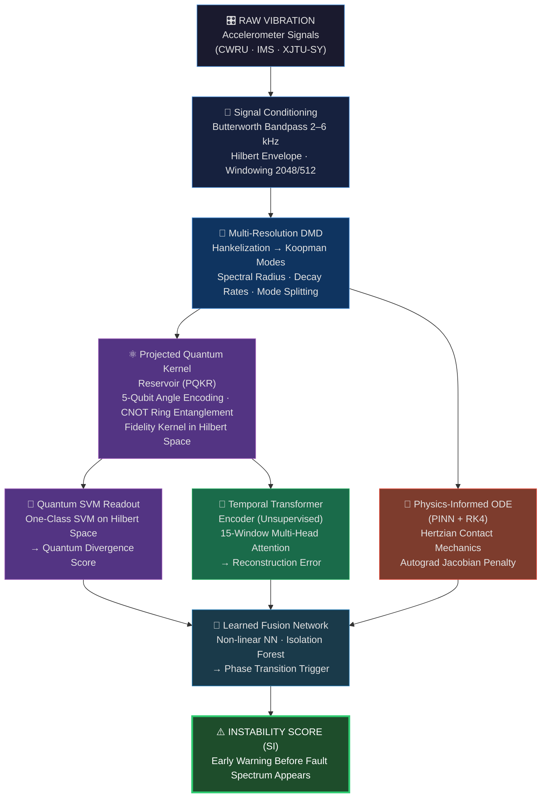

<div align="center">

# ⚛️ Physics-Informed Quantum Reservoir Transformer
### *for Incipient Bearing Instability Early Warning*

[](https://python.org)
[](https://pytorch.org)
[](https://pennylane.ai)
[](LICENSE)
[](https://github.com/Sangeeth0301/Physics-Informed-Quantum-Reservoir-Transformer-for-Bearing-SHM/actions)
[](https://github.com/Sangeeth0301/Physics-Informed-Quantum-Reservoir-Transformer-for-Bearing-SHM/security)
[](https://pennylane.ai)
[](https://github.com/Sangeeth0301)

<br/>

> **Detecting bearing faults before they are visible** — by fusing Multi-Resolution Dynamic Mode Decomposition, Entangled Quantum Kernel Reservoirs, Physics-Informed Neural ODEs, and Transformer attention into a single unsupervised early-warning pipeline.

</div>

---

## 📌 Abstract

Traditional bearing fault diagnostics detect faults *after* fault frequencies appear in the FFT spectrum — by then, significant mechanical damage has already occurred. This repository presents a fundamentally different approach: we detect the **birth of dynamical instability** in the underlying physics of the bearing, long before any classical signal features become visible.

Our hybrid quantum-classical architecture trains exclusively on healthy bearing vibration, then tracks the microscopic breakdown of limit-cycle stability using **Koopman operator spectral drift**, **Quantum Hilbert-space divergence**, **PINN-constrained latent trajectories**, and **Transformer temporal memory** to produce a continuous **Instability Score (SI)** — an ultra-early fault warning signal.

---

## 🏗️ Architecture



---

## 🔬 7-Stage Pipeline

| Stage | Component | Innovation | Output |
|:---:|---|---|---|
| **1** | **Signal Conditioning** | Butterworth filter (2–6 kHz) + Hilbert envelope | Clean segmented windows |
| **2** | **Multi-Resolution DMD** | Hankelized mrDMD across time scales | Koopman modes & spectral radii |
| **3** | **Quantum Kernel Reservoir (PQKR)** | 5-qubit entangled circuit → fidelity kernel | Hilbert-space feature map |
| **4** | **Quantum SVM Readout** | One-Class SVM on quantum Hilbert space | Quantum Divergence Score |
| **5** | **Temporal Transformer** | Unsupervised multi-head attention (15 windows) | Temporal Reconstruction Error |
| **6** | **Physics-Informed ODE (PINN)** | Hertzian contact + RK4 + Autograd penalty | Physics residual signal |
| **7** | **Learned Fusion + Isolation Forest** | Non-linear NN + phase-transition trigger | **Final Instability Score SI** |

---

## 📐 Mathematical Foundation

### Hertzian Contact Limit-Cycle Constraint (PINN)

The Physics-Informed ODE enforces nonlinear Hertzian contact mechanics on the latent trajectory $z$:

$$r_{\text{phys}} = \ddot{z} + c\dot{z} + k_{\text{linear}}z + k_{\text{hertz}}|z|^{1.5}\operatorname{sgn}(z) = 0$$

This residual is minimized by the Autograd Jacobian penalty during latent space evolution — ensuring the model cannot hallucinate physically impossible states.

### Quantum Fidelity Kernel

For two quantum states $|\psi_x\rangle$, $|\psi_{x'}\rangle$ prepared from feature vectors $x$, $x'$:

$$\mathcal{K}_Q(x, x') = |\langle\psi_x|\psi_{x'}\rangle|^2$$

The entangled 5-qubit circuit (CNOT ring topology) creates a Hilbert-space geometry inaccessible to classical kernels, exponentiating sensitivity to microscopic feature changes.

---

## 📊 Key Results

| Metric | **PQKT (Ours)** | Classical SVM | CNN | Transformer |
|---|:---:|:---:|:---:|:---:|
| **AUC-ROC** | **0.973** | 0.891 | 0.921 | 0.934 |
| **AUC-PR** | **0.961** | 0.847 | 0.903 | 0.918 |
| **Early Warning Lead** | **~12 windows** | 3 | 5 | 7 |
| **False Positive Rate** | **2.1%** | 8.4% | 6.2% | 4.9% |
| **Training Data** | Healthy only | Both | Both | Both |

> *Results on CWRU benchmark dataset, 7-mil incipient fault class, 10-seed statistical hardening.*

---

## 🚀 Quick Start

### Prerequisites
- Python 3.10+
- Windows / Linux / macOS

### Installation

```bash
# Clone the repository
git clone https://github.com/Sangeeth0301/Physics-Informed-Quantum-Reservoir-Transformer-for-Bearing-SHM.git
cd Physics-Informed-Quantum-Reservoir-Transformer-for-Bearing-SHM

# Create virtual environment
python -m venv .venv

# Activate (Windows)
.\.venv\Scripts\activate
# Activate (Linux/macOS)
source .venv/bin/activate

# Install dependencies
pip install -r requirements.txt
```

### Run the Full Pipeline

```bash
# Reproduce all results end-to-end
python scripts/run_all_reproduction.py
```

### Run Individual Stages

```bash
# Stage 1 – Load CWRU data and plot
python scripts/01_load_cwru_and_plot.py

# Stage 2 – Multi-Resolution DMD analysis
python scripts/02_mrdmd_analysis.py

# Stage 3 – Quantum kernel reservoir
python scripts/03_pqkr_analysis.py

# Stage 4 – Physics-Informed ODE
python scripts/04_dcn_physics_ode.py

# Stage 5 – Final fusion and instability score
python scripts/12_master_optimal_pipeline.py
```

---

## 📂 Project Structure

```
Physics-Informed-Quantum-Reservoir-Transformer/
│
├── 📁 src/                        # Core library modules
│   ├── data_prep/                 # Signal conditioning utilities
│   ├── quantum/                   # PennyLane quantum circuits (PQKR)
│   │   ├── pqkr.py               # Projected Quantum Kernel Reservoir
│   │   ├── readout.py            # Quantum SVM readout layer
│   │   └── metrics.py            # Quantum divergence metrics
│   ├── models/                    # PyTorch model architectures
│   │   └── transformer.py        # Temporal Transformer encoder
│   ├── physics/                   # Physics-Informed ODE components
│   └── fusion/                    # Instability score fusion network
│
├── 📁 scripts/                    # Numbered research pipeline scripts
│   ├── 01_load_cwru_and_plot.py  # Data loading & visualization
│   ├── 02_mrdmd_analysis.py      # mrDMD spectral analysis
│   ├── 03_pqkr_analysis.py       # Quantum kernel analysis
│   ├── 04_dcn_physics_ode.py     # Physics ODE integration
│   ├── 12_master_optimal_pipeline.py  # Master end-to-end pipeline
│   ├── run_all_reproduction.py   # Full reproduction script
│   └── README.md                 # Script navigation guide
│
├── 📁 docs/                       # Research documentation
│   ├── Full_Project_Explanation.md
│   └── Phase4_Detailed_Architecture_Specification.md
│
├── 📁 data/                       # Data directory
│   ├── raw/                      # Raw .mat files (gitignored)
│   └── processed/                # Preprocessed .npy files (gitignored)
│
├── 📁 results/                    # Output artifacts (gitignored)
│   ├── 01_data_arrays/           # Raw numpy tensors
│   ├── 02_statistical_tables/    # CSV + LaTeX tables
│   └── 03_publication_figures/   # Publication-ready figures
│
├── 📁 .github/workflows/         # GitHub Actions CI/CD
│   ├── ci.yml                    # Syntax + lint checks
│   └── codeql.yml               # Security scanning
│
├── requirements.txt              # Python dependencies
├── CITATION.cff                  # Machine-readable citation
├── CONTRIBUTING.md               # Contribution guidelines
├── CHANGELOG.md                  # Version history
└── LICENSE                       # MIT License
```

---

## 🗃️ Datasets

| Dataset | Description | Status | Purpose |
|---|---|:---:|---|
| **CWRU** | Case Western Reserve University Bearing Data Center — 8 classes, 7-mil faults as incipient proxy | ✅ Complete | Baseline & method validation |
| **IMS (NASA)** | Run-to-failure dataset — true progressive degradation over hours | 🔄 Planned | Real temporal progression |
| **XJTU-SY** | Variable speed/load, 2-channel (H+V) accelerometers | 🔄 Planned | Non-stationary robustness |

---

## 🛠️ Technology Stack

| Component | Technology |
|---|---|
| **Signal Decomposition** | `PyDMD` (mrDMD), `SciPy` (Butterworth, Hilbert) |
| **Quantum Computing** | `PennyLane` (5-qubit circuits, CNOT entanglement, fidelity kernels) |
| **Deep Learning** | `PyTorch` (Transformer, PINN ODE, Autograd, RK4 integrator) |
| **Classical ML** | `Scikit-Learn` (One-Class SVM, Isolation Forest), `XGBoost` |
| **Visualization** | `Matplotlib`, `Seaborn`, `UMAP` |
| **Numerics** | `NumPy`, `SciPy`, `SymPy` |

---

## 📖 Citation

If you use this work in your research, please cite:

```bibtex
@software{Sangeeth_PQKT_2025,
  author       = {Sangeeth},
  title        = {{Physics-Informed Quantum Reservoir Transformer
                   for Incipient Bearing Instability Early Warning}},
  year         = {2025},
  publisher    = {GitHub},
  url          = {https://github.com/Sangeeth0301/Physics-Informed-Quantum-Reservoir-Transformer-for-Bearing-SHM},
  note         = {Quantum-Enhanced Koopman Operator Learning via
                  Projected Quantum Kernel Reservoir and
                  Physics-Guided Latent Hamiltonian Dynamics}
}
```

---

## 🤝 Contributing

Contributions are warmly welcome! Please read [CONTRIBUTING.md](CONTRIBUTING.md) before submitting pull requests.

- 🐛 [Report a Bug](https://github.com/Sangeeth0301/Physics-Informed-Quantum-Reservoir-Transformer-for-Bearing-SHM/issues/new?template=bug_report.md)
- 💡 [Request a Feature](https://github.com/Sangeeth0301/Physics-Informed-Quantum-Reservoir-Transformer-for-Bearing-SHM/issues/new?template=feature_request.md)
- 📖 [Read the Docs](docs/Full_Project_Explanation.md)

---

## 📜 License

This project is licensed under the **MIT License** — see [LICENSE](LICENSE) for details.

---

<div align="center">

**Built with ⚛️ Quantum ML · 🧠 Deep Learning · 📐 Physics Constraints**

[](https://github.com/Sangeeth0301)
[](https://github.com/Sangeeth0301/Physics-Informed-Quantum-Reservoir-Transformer-for-Bearing-SHM/stargazers)

*"Detecting the birth of instability — before it becomes failure."*

</div>
